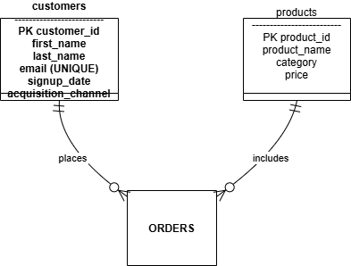

# Retail Analytics Database

[](https://www.postgresql.org/)
[](https://www.python.org/)
[](https://pypi.org/project/psycopg2-binary/)

## Overview
This project is an end-to-end retail analytics solution built on PostgreSQL as the **analytics engine** and Python as the **orchestration runtime**, focused on actionable business intelligence and production-grade SQL.

- 📘 High-level system and database design: see [Architecture Documentation](./ARCHITECTURE.md).
- 📊 Stakeholder-facing insights and examples: see [Business Insights](./insights/business_insights.md).
## 🎯 Key Features

- **Normalized Schema Design**: Fully normalized 3NF database structure
- **Advanced Analytics**: Customer lifetime value, RFM segmentation, cohort analysis
- **Performance Optimized**: Strategic indexes for sub-second query responses
- **Data Quality Checks**: Comprehensive validation queries
- **KPI Dashboard**: Real-time business metrics and trends
- **Realistic Data Generation**: Python script with 1000+ synthetic records

## 📊 Database Schema



### Tables

- **customers**: Customer profiles and acquisition channels
- **products**: Product catalog with pricing
- **orders**: Transaction fact table with referential integrity

## 🚀 Quick Start

### Prerequisites

```bash
# Required
PostgreSQL 13+
Python 3.8+
psycopg2

# Install Python dependencies
pip install psycopg2-binary
```

### Setup Instructions

```bash
# 1. Clone repository
git clone https://github.com/mr-adonis-jimenez/retail-analytics-sql.git
cd retail-analytics-sql

# 2. Create database
psql -U postgres
CREATE DATABASE retail_analytics;
\q

# 3. Initialize schema
psql -U postgres -d retail_analytics -f schema/schema.sql

# 4. Generate sample data
cd scripts
python generate_data.py

# 5. Run analytics queries
psql -U postgres -d retail_analytics -f queries/customer_lifetime_value.sql
```

## 📁 Project Structure

```
retail-analytics-sql/
├── schema/
│   ├── schema.sql              # Database structure with indexes
│   └── er_diagram.png          # Visual schema representation
├── scripts/
│   ├── generate_data.py        # Realistic data generator
│   └── sample_data.sql         # Manual sample data
├── queries/
│   ├── customer_lifetime_value.sql
│   ├── customer_segmentation_analysis.sql
│   ├── product_category_analysis.sql
│   ├── monthly_sales_trends.sql
│   ├── inventory_turnover_analysis.sql
│   ├── store_performance_comparison.sql
│   ├── cross_selling_opportunities.sql
│   └── business_queries.sql
├── analytics/
│   └── kpi_dashboard.sql       # Comprehensive BI dashboard
├── validation/
│   └── data_quality_checks.sql # Data integrity validation
├── admin/
│   └── performance_analysis.sql # Database performance monitoring
├── insights/
│   └── business_insights.md    # Key findings and recommendations
└── README.md
```

## 🔍 Key Analyses

### 1. Customer Lifetime Value (CLV)
```sql
-- Calculate CLV with segmentation
SELECT 
    customer_id,
    SUM(order_total) AS lifetime_value,
    COUNT(DISTINCT order_id) AS total_orders,
    AVG(order_total) AS avg_order_value
FROM orders
GROUP BY customer_id
ORDER BY lifetime_value DESC;
```

### 2. RFM Segmentation
Segment customers by Recency, Frequency, and Monetary value:
- **Champions**: High scores across all dimensions
- **Loyal Customers**: Frequent buyers
- **At Risk**: Haven't purchased recently
- **Lost**: Inactive for extended periods

### 3. Monthly Revenue Trends
Track month-over-month growth with:
- Revenue trends
- Customer acquisition rates
- Average order value changes

## 💡 Business Insights

### Key Findings

- **Top 20% products** generate 65-75% of revenue (Pareto Principle)
- **Repeat purchase rate** indicates customer loyalty levels
- **Acquisition channel ROI** shows Email & Referral outperform Paid Search
- **Seasonal trends** reveal Q4 revenue spikes

[View detailed insights →](insights/business_insights.md)

## 🛠️ Technical Skills Demonstrated

### SQL Techniques
- ✅ Complex multi-table JOINs (INNER, LEFT, OUTER)
- ✅ Window functions (RANK, NTILE, LAG, PARTITION BY)
- ✅ Common Table Expressions (CTEs)
- ✅ Aggregate functions with GROUP BY and HAVING
- ✅ Subqueries (correlated and non-correlated)
- ✅ Date/time manipulation
- ✅ CASE statements for conditional logic
- ✅ Index optimization for performance

### Data Analysis
- ✅ Cohort analysis
- ✅ RFM segmentation
- ✅ Time-series trend analysis
- ✅ Statistical anomaly detection
- ✅ Cross-selling opportunity identification

### Database Administration
- ✅ Schema normalization
- ✅ Constraint enforcement (CHECK, FOREIGN KEY)
- ✅ Index strategy
- ✅ Query optimization
- ✅ Data validation
- ✅ Performance monitoring

## 📈 Performance Benchmarks

| Query Type | Rows Scanned | Execution Time | Optimization |
|------------|--------------|----------------|-------------|
| Customer CLV | 1,000 orders | <50ms | Indexed customer_id |
| Monthly Trends | Full dataset | <100ms | Indexed order_date |
| Product Rankings | All products | <75ms | Indexed product_id |
| RFM Analysis | 200 customers | <150ms | Composite index |

## 🔒 Data Integrity

### Constraints Implemented

```sql
-- Price validation
CHECK (price > 0)

-- Quantity validation
CHECK (quantity > 0)

-- Order total validation
CHECK (order_total >= 0)

-- Referential integrity
FOREIGN KEY (customer_id) REFERENCES customers(customer_id) ON DELETE CASCADE
FOREIGN KEY (product_id) REFERENCES products(product_id) ON DELETE RESTRICT
```

### Validation Queries

Run data quality checks:

```bash
psql -U postgres -d retail_analytics -f validation/data_quality_checks.sql
```

Checks include:
- Orphaned records
- Negative values
- Future dates
- Duplicate entries
- NULL values in required fields
- Statistical anomalies

## 📊 Sample Outputs

### Top Customers by CLV

| Customer | Total Orders | Lifetime Value | Avg Order Value |
|----------|--------------|----------------|----------------|
| John Smith | 45 | $12,450.00 | $276.67 |
| Sarah Johnson | 38 | $9,870.50 | $259.75 |
| Mike Davis | 32 | $8,920.25 | $278.76 |

### Revenue by Channel

| Channel | Customers | Revenue | Avg CLV |
|---------|-----------|---------|--------|
| Email | 45 | $45,230 | $1,005 |
| Referral | 38 | $38,910 | $1,024 |
| Organic | 52 | $34,560 | $665 |
| Paid Search | 65 | $32,100 | $494 |

## 🚧 Future Enhancements

- [ ] Add materialized views for faster dashboard queries
- [ ] Implement stored procedures for common operations
- [ ] Create data warehouse star schema for OLAP
- [ ] Add predictive analytics with Python integration
- [ ] Build Tableau/Power BI dashboards
- [ ] Implement automated data quality monitoring
- [ ] Add time-series forecasting models

## 🛠️ Troubleshooting

### Common Issues

**Connection Error**
```bash
# Check PostgreSQL is running
sudo service postgresql status

# Update DB_CONFIG in generate_data.py with your credentials
```

**Permission Denied**
```sql
-- Grant necessary permissions
GRANT ALL PRIVILEGES ON DATABASE retail_analytics TO your_username;
```

**Slow Queries**
```bash
# Run performance analysis
psql -U postgres -d retail_analytics -f admin/performance_analysis.sql

# Check if indexes exist
\di
```

## 📚 Resources

- [PostgreSQL Documentation](https://www.postgresql.org/docs/)
- [SQL Performance Explained](https://sql-performance-explained.com/)
- [Window Functions Guide](https://www.postgresql.org/docs/current/tutorial-window.html)

## 👤 Author

**Adonis Jimenez**
- LinkedIn: [linkedin.com/in/adonisjimenez](https://linkedin.com/in/adonisjimenez)
- GitHub: [@mr-adonis-jimenez](https://github.com/mr-adonis-jimenez)
- Portfolio: [adonisjimenez.com](https://adonisjimenez.com)

## 📄 License

This project is licensed under the MIT License - see the [LICENSE](LICENSE) file for details.

## 🙏 Acknowledgments

- Inspired by real-world retail analytics challenges
- Built to demonstrate SQL proficiency for data analyst roles
- Data generation methodology based on industry best practices

---

**Last Updated**: January 19, 2026

*This project demonstrates advanced SQL skills, database design, and business intelligence capabilities for data analytics positions.*
